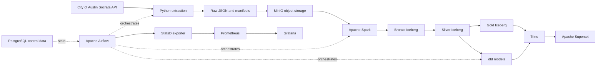

# Austin Crime Data Lakehouse

An end-to-end data lakehouse for the City of Austin Crime Reports
dataset. The project extracts public records from Socrata, stores the
raw responses, builds governed Apache Iceberg tables, and serves
analytics through Trino, dbt, and Apache Superset.

This is a local-first educational project built with production-style
data-engineering practices: incremental ingestion, idempotent merges,
data-quality tests, orchestration, reconciliation, monitoring, and CI.

Source dataset: [City of Austin Crime Reports](https://data.austintexas.gov/Public-Safety/Crime-Reports/fdj4-gpfu/about_data)
(`fdj4-gpfu`).

## Architecture



The project currently uses Iceberg's JDBC catalog backed by PostgreSQL.
MinIO stores the table data, while PostgreSQL stores catalog metadata,
watermarks, extraction batches, file manifests, and pipeline status.

See [Architecture and design](docs/architecture.md) for the detailed
data flow and design decisions.

## Pipeline behavior

The `austin_crime_pipeline` Airflow DAG runs daily at 6:00 AM Central
Time. It queries records whose Socrata `:updated_at` value is newer than
the last successful watermark and closes the batch at a fixed upper
timestamp.

The extractor selects one of four outcomes:

| Outcome | Behavior |
| --- | --- |
| `NO_CHANGES` | Record a successful no-op run and skip processing. |
| `INCREMENTAL` | Download changed records and merge them into Bronze. |
| `FULL_SNAPSHOT` | Replace Bronze when the source reports every record as changed. |
| `REVIEW_REQUIRED` | Stop for review when at least 80%—but not all—of the source appears changed. |

The watermark advances only after extraction, storage, Spark processing,
dbt, and cross-layer validation succeed. A separate reconciliation DAG
runs at 8:00 AM Central Time on the first day of each month and performs
a full source-to-Bronze comparison.

The Austin dataset periodically republishes its complete contents and
regenerates Socrata system IDs, versions, and update timestamps. During
those publications, every row satisfies the incremental timestamp
filter even though most business values are unchanged. The pipeline
therefore uses a full snapshot for correctness and to capture removed
incidents. This is a property of this dataset's publication process, not
a claim about every Socrata dataset.

## Data layers

| Layer | Purpose |
| --- | --- |
| Raw | Immutable API response pages and a batch manifest in MinIO. |
| Bronze | Source-aligned Iceberg table with ingestion metadata and deduplicated incremental merges. |
| Silver | Typed and standardized crime records, partitioned by occurrence year. |
| Gold | Monthly Spark aggregates for crime, clearance, and family-violence reporting. |
| dbt | Staging, enriched incident facts, monthly trends, and clearance-rate marts queried through Trino. |

## Technology stack

| Area | Technology |
| --- | --- |
| Source | City of Austin Socrata API |
| Ingestion | Python, Requests, psycopg |
| Object storage | MinIO |
| Processing | Apache Spark 3.5 |
| Table format | Apache Iceberg |
| Catalog and control data | PostgreSQL |
| SQL engine | Trino |
| SQL transformations | dbt-trino |
| Orchestration | Apache Airflow |
| BI | Apache Superset |
| Metrics | StatsD exporter, Prometheus, Grafana |
| Local runtime | Docker Compose |
| CI | GitHub Actions |

## Getting started

### Prerequisites

- Docker Desktop with Docker Compose
- Git
- Python 3.12
- A Socrata application token
- Enough Docker memory for the Spark jobs; the pipeline currently uses a
  6 GB Spark driver

Create the local configuration and Python environment:

```powershell
Copy-Item .env.example .env
py -3.12 -m venv .venv
.\.venv\Scripts\Activate.ps1
python -m pip install -r requirements-dev.txt
```

Replace the placeholder values in `.env`, especially
`SOCRATA_APP_TOKEN`, database passwords, MinIO credentials, and the
Superset secret key. Never commit `.env`.

For a brand-new environment, complete the
[first-time initialization](docs/operations.md#first-time-initialization).
After initialization, start or refresh the platform with:

```powershell
docker compose up -d --build
docker compose ps
```

## Local services

| Service | URL |
| --- | --- |
| Airflow | <http://localhost:8082> |
| Superset | <http://localhost:8088> |
| Trino | <http://localhost:8080> |
| MinIO Console | <http://localhost:9001> |
| Prometheus | <http://localhost:9090> |
| Grafana | <http://localhost:3000> |

Operational commands and troubleshooting steps are in the
[operations runbook](docs/operations.md).

## Validation

Run the local checks from the repository root:

```powershell
python -m compileall -q src airflow/dags tests
python -m pytest
dbt parse --project-dir austin_crime --profiles-dir airflow/dbt
docker compose config --quiet
git diff --check
```

The standard GitHub Actions workflow repeats these checks and builds the
Airflow image. The manually triggered `Bronze integration` workflow uses
isolated fixtures to verify inserts, updates, incoming-batch
deduplication, unchanged records, and idempotent reprocessing without
touching the production-style Bronze table.

See [the integration-test guide](tests/integration/README.md) to run the
same Bronze test locally.

## Repository layout

```text
airflow/                 Airflow image, DAGs, and dbt connection profile
austin_crime/            dbt project
docs/                    Architecture and operating documentation
infra/                   PostgreSQL, Trino, monitoring, and Superset config
src/ingestion/           Full and incremental Socrata extraction
src/storage/             MinIO upload steps
src/processing/          Spark Bronze, Silver, Gold, and reconciliation jobs
src/operations/          Pipeline finalization and watermark management
src/reconciliation/      Periodic source snapshot creation
src/validation/          Cross-layer validation
tests/                   Unit tests and isolated Bronze fixtures
compose.yaml             Local service definitions
```

## Current scope

The first release intentionally supports one batch-oriented public
dataset and a local Docker environment. It does not yet implement a
Polaris REST catalog, quarantine/history tables, automated schema-drift
classification, cloud deployment, or machine learning. These remain
possible future phases after the batch platform is stable.

A future ingestion optimization may use a source-calculated hash of the
stable business fields. That approach should only be implemented if
Socrata can calculate the fingerprint reliably; `:id`, `:version`, and
`:updated_at` are not stable change indicators for this dataset.
